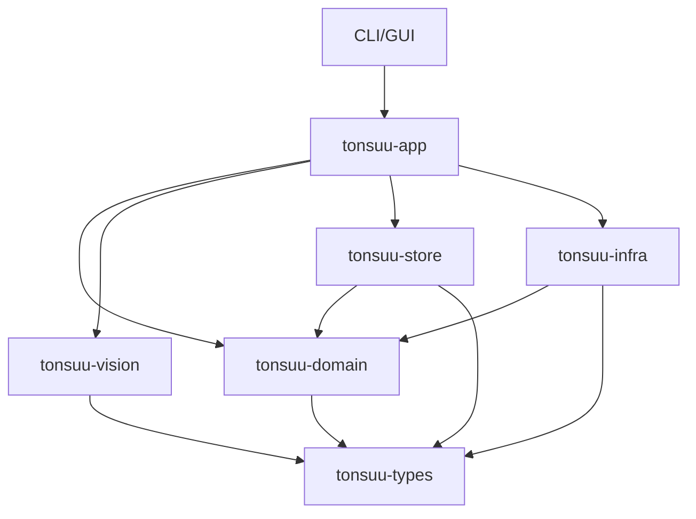

# Tonsuu Checker Design (2026-02-08)

## Goals
- Restore clean dependency direction: UI → App → Domain → Types
- Unify duplicate domain models (WeighingSlip, VehicleMaster)
- Formalize persistence and I/O boundaries
- Keep AI inference isolated and swappable

## Current Issues
- Domain depends on Store types (dependency inversion broken)
- Duplicate domain models in services and models
- Missing or placeholder modules in app/infra
- UI depends directly on Store

## Target Architecture
- `tonsuu-types`: shared DTOs and errors only
- `tonsuu-domain`: single source of truth for domain models + business rules
- `tonsuu-vision`: AI inference adapter; returns `EstimationResult`
- `tonsuu-store`: persistence implementations (JSON history, vehicles)
- `tonsuu-infra`: external I/O (CSV/EXIF/import), encoding/format specifics
- `tonsuu-app`: use case orchestration, cache strategy, history registration
- `tonsuu-cli` / `tonsuu-gui`: UI only; depend on app layer

### Dependency Direction
```
UI (CLI/GUI)
  -> App (use cases)
    -> Domain (models + rules)
      -> Types (shared DTO/errors)
Store/Infra/Vision are implementations that App depends on.
```

## Mermaid: Dependency Graph


## Data Flow
### AI Analysis
1. UI calls `tonsuu-app::analysis`
2. App builds `AnalyzerConfig` and delegates to `tonsuu-vision`
3. Vision returns `EstimationResult`
4. App persists via `AnalysisHistoryRepository`

### Vehicle Registration
1. UI uses `tonsuu-app::vehicles`
2. App delegates to `VehicleRepository`
3. Store persists JSON

### Overload Check
1. UI calls `tonsuu-app::overload_check`
2. App loads CSV via `tonsuu-infra::csv_loader`
3. Domain runs `overload_checker` on model types
4. UI renders report

## Model Unification Plan
- Move or consolidate `WeighingSlip` and `VehicleMaster` into `tonsuu-domain::model`
- Remove duplicate definitions in `service::overload_checker`
- Update CSV loaders to parse directly into unified domain types
- Ensure `overload_checker` only accepts domain model types

## Repository Boundary
- `tonsuu-domain::repository` traits must only depend on domain model types
- `tonsuu-store` implements these traits (file-based JSON)
- UI no longer touches Store directly

## Error Handling
- `tonsuu-infra` returns format/IO errors as-is
- `tonsuu-domain` surfaces domain-specific validation errors
- `tonsuu-app` is the error boundary; UI only formats user-facing messages

## Testing Strategy
- Domain: overload rules, plate normalization, calculation rules
- Infra: CSV parsing (CP932), date parsing, numeric parsing
- Vision: JSON extraction, ensemble merge behavior
- App: minimal integration tests for use cases

## Implementation Phases
1. Fix dependency inversion (domain repository traits decouple from store types)
2. Unify duplicate domain models
3. Provide concrete repository implementations in store/infra
4. Update app layer to orchestrate flows
5. Update CLI/GUI to depend only on app layer
6. Add or update tests for regressions

## Risks
- Type migration may break CLI/GUI compilation
- JSON persistence schema changes may break existing data
- CSV import edge cases (encoding/format variations)

## Notes
- Keep `tonsuu-vision` independent; avoid domain-specific logic there
- Preserve existing CLI/GUI command behavior during migration
